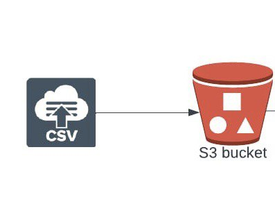
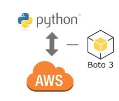

# Learning Data Engineering
## Project Description:
This is a simple python program that:
 - CREATES an AWS S3 bucket ***programmatically*** using the [`boto3 library`] (https://boto3.readthedocs.io),

 - UPLOAD a csv file contained with arbitrary(fake) data generated with the python `faker library` to the created  S3 bucket using the `boto3 library`,

 - DELETE the bucket and its contents with the `boto3 library`.

## Project objective: 

 

The projects aims to demonsrate simply how to use python with AWS via it Boto3 library in connecting/upload to an S3 bucket.

Programmatically was emphasized because all this actions can be done similarly with the AWS console, but performing this actions with python scripts gives the ***GREAT ADVANTAGE OF AUTOMATION*** and as a _Data Engineer_, this is a pioneering mindset.

## Technologies/Packages/Tools used:
*  Cloud services - AWS S3 object storage
*  Python faker library
*  Languages -- Python and SQL

## How to run the program:
 - A functioning AWS account with the below information; 
   - `aws_access_key_id`
   - `aws_secret_access_key`

- The project does contain a requirement.txt, install the required libraries by running `$ pip install -r requirement.txt` in the project terminal.

It is advisable to use an [`AWS IAM USER`], read about this from (https://docs.aws.amazon.com) for best practices as I also did.
>### additional information:
>   - any preferred location permissible by the `Boto3 library`,
>   - bucket name which is required to be unique globally,
>   - filename is hardcoded as "file100.csv", but you can change it in the `create_bucket.py` script.

Unfortunately we cannot create an AWS account from a python script :rofl: :rofl:, visit the [official AWS website] (https://aws.amazon.com).

## Note:
 The information from the requirements (**access_key, secret_access_key and bucket_name**) would be supplied into the `connection.conf` which is the ***only expected section of this program to be altered to successfully run the program***. Of course, it's your code now :+1:, you can make any amount of changes.
 
 I used both of the `boto3` API call - `Client` and `Resource` for the sake of *expanding our horizons*, either is completely usable alone to run the program, I'll encourage to check the internet for more to see the difference.

## Using the scripts:
The program is separated into three python script and built to run independently;
- `create_bucket.py` for  creating the S3 bucket with the supplied _AWS account credentials_, advised to be run first if starting with a new bucket.
- `upload_csv_to_bucket.py ` to generate and upload the csv file to _bucket and location specified_ in the `connection.conf` file.
- `delete_bucket.py` deletes the bucket, ensure it is deleted (review the code). If only you so wish.

## Improving our program
 - We can do better by involving a scheduler like Airflow to automate running the scripts consecutively.
 - A messaging system like Amazon SNS (Simple Notification Service) to update us regarding the state of our program.
 - The program becoming an application if containerised with Docker and be shared publicly in DockerHub.

Want to try out the program, read the short "setup.txt" to get things working properly.

More of this is definitely coming, do come back to check them out.
